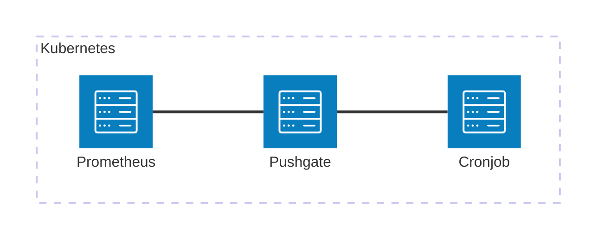

# Kubernetes Speedtest  

This fork has the objective of migrate on of my most used docker containers leveraging golang, k8s, and pushgate. 

## Design

```mermaid
architecture-beta
    group api[Kubernetes]

    service cronjob(server)[Cronjob] in api
    service pushgate(server)[Pushgate] in api
    service prometheus(server)[Prometheus] in api

    cronjob:L -- R:pushgate
    pushgate:L -- R:prometheus
```

